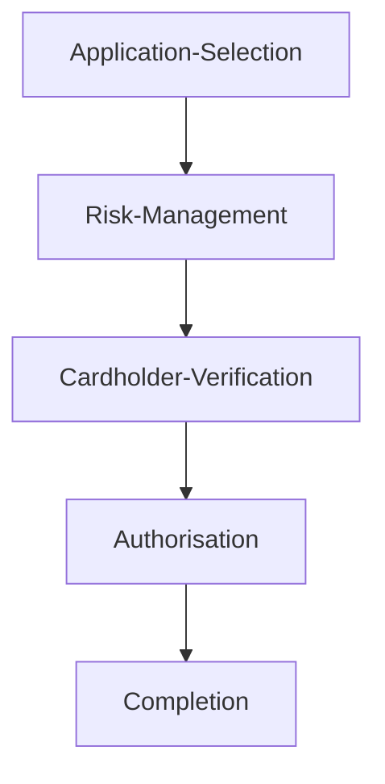

# My basic EMV simulator!

EMV stands for Europay, Mastercard and Visa, it is the standard globally for making payments securely using cards with a chip, which is the new standard due to how easy fraud is with a magnetic strip card. EMV prevents fraud by supporting PIN verification, transaction limits and issuer authentication.

EMV cards store payment information on an embedded microchip and interact with terminals to verify the cardholders identity as well as authorise transactions.

My project simulates an EMV payment flow, including card and terminal interaction, transaction stages, PIN verification and issuer authorisation. It is intended as a portfolio demonstration of EMV logic as well as an example of me using OOP (Object Oriented Programming) in a C# console app.

## Key components

**EmvCard** represents a chip card. It handes PAN (Primary Account Number), Pin validation and contactless limits.

**EmvTerminal** represents a payment terminal, it determines if a Pin is required and processes transaction stages.

**EmvTransaction** models a transaction through these EMV stages:

**IssuerBank** simulates the card issuer, it checks funds and authorises transactions

**EmvLogger** logs transaction strages and results for clarity and testing purposes

## What did I miss out?

I decided to leave out a few more complicated features, however here is what they are how I would do them if I took more time.

I didn't implement **Cryptograms**, the program just assumes that the card is trusted. Real EMV cards generate a **Cryptogram** (Cryptographically signed data) for each transaction. This is to ensure that the transaction data isn't tampered with after completion. In a real EMV system, the cryptogram would be created using transaction data and secret keys shared with the issuer, to impliment this myself, I would create a database of certified keys linked to each issuer bank using SQL or perhaps a nosql solution such as MongoDB.

I also didn't impliment **Offline Authorisation/Risk Management**, EMV can allow offline approval or decline based on card risk parameters (data points used by payment processors and merchants used to evaluate how liklely fraud or credit default is in transaction processing) and transaction limits. My program only simulates online authorisation via IssuerBank. To impliment this, I would have to also use a database to store transaction history and calculate the risk of the card and user, which was outside of the scope of this program.

Outside of EMV, I would also like to have introduced automated unit testing and perhaps make it a REST API to use within a website frontend.

## What else is interesting to know about EMV?

EMV comes in **3 levels**. **Level 1** focuses on the physical and electrical part of the EMV system, as well as the protocol. It focuses mainly on hardware interfacing such as chip contacts, voltage and antennas for contactless.

It also checks protocol compliance with ISO. This is to ensure that the terminal and card both understand the same basic commands, like how two people may insure that they know basics of the same language before attempting to complete a transaction in a shop!

On the other hand, **Level 2** is for application logic. It tests the flow of the transaction as well as decision logic. This is risk management, cardholder verification, authorisation and completion of the transaction. It checks things like the contactless limit and offline/online pin.

Level 2 makes up the bulk of my simulation due to Level 1 being more hardware based. Level 2 can also include decline reasons and logging. My **EmvTransaction** class models the stages and **IssuerBank** simulates authorisation.

**Level 3** Is to ensure the entire payment system works end-to-end, including issuer, acquirer and payment networks.

It manages the full transaction flow across networks (Visa/Mastercard/American Express) and usually uses test cards and real payment terminals connected to a test network. It also tests multi-currency transactions.

I am still learning a lot about Level 3 testing and it is not implimented in my simulation due to the project being limited to a local terminal and card. Level 3 was unfortunately out of the scope but I am excited to learn more about it.

## How was the project to do?

Despite it being a pretty light project, having done it over the span of 2 days, I learned so much about EMV and my understanding of classes and program structure in C# was also improved. I am actually extremely interested in EMV and it really does intrigue me. I really look forward to trying to learn more about it in future. I wasn't aware how many layers there were to banking systems.

I may return to this to complete the "What did I miss out?" section, because I really do want to learn more!
